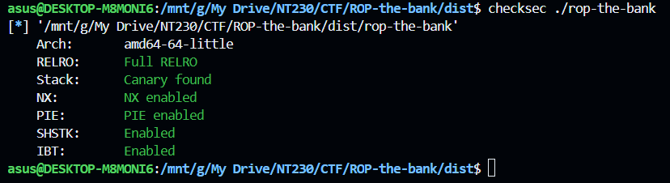
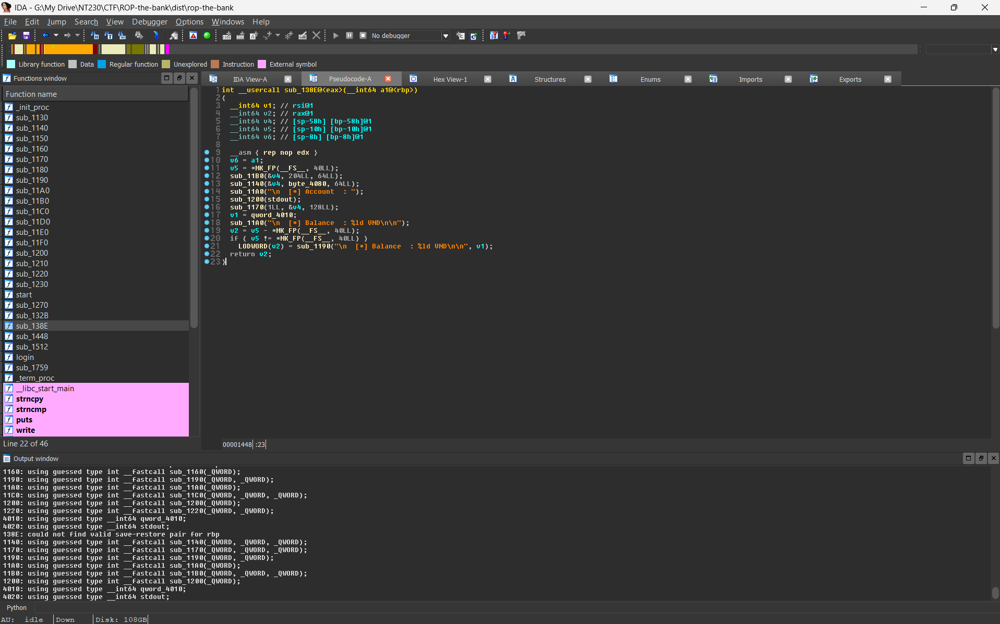
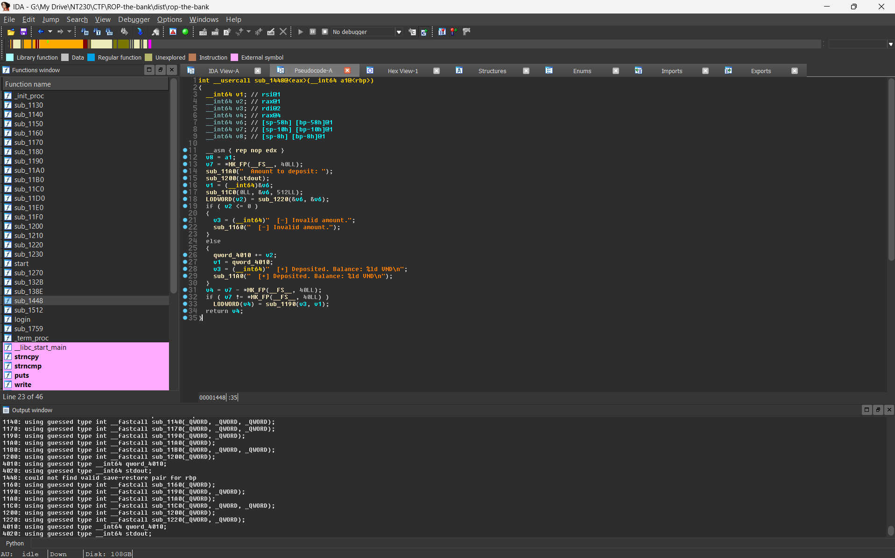

# Writeup: ROP-the-bank

**Difficulty**: Hard  
**Category**: Pwn  
**Techniques**: Stack Over-read, Ret2Libc, ROP
**Description**: Bypass the state-of-the-art memory mitigations of this secure ATM and walk away with a shell.

## 1. Analysis

First, we check the binary's protection mechanisms using `checksec`:

The program is a simple banking account management application.

## 2. Vulnerability Discovery

### 2.1. Stack Over-read Vulnerability

In the `sub_138E()` function:

Based on the pseudocode from IDA Pro, the program declares a 64-byte array `v4` on the stack, but then uses the `write` function to output exactly 128 bytes. This flaw leads to an Over-read vulnerability, allowing us to inspect sensitive data residing on the stack immediately following the `v4` array. This data includes the **Stack Canary** and the **Return Address**, from which we can calculate the **PIE base**.

### 2.2. Buffer Overflow Vulnerability

In the `sub_1448()` function:

The variable `v6` is 64 bytes in size, but the `read` function allows an input of up to 512 bytes. This is a very classic Buffer Overflow vulnerability. Combined with the leaked Canary and PIE base obtained earlier, we can cleanly overwrite the Return Address to hijack the execution flow via ROP (Return-Oriented Programming).

## 3. Exploitation Process

### Step 1: Login

The `login()` function compares the PIN code against a hardcoded string `"1337\n"`. We can simply enter any Username and the PIN `1337` to log in successfully. 
*(Fun fact: There is a hidden Easter Egg implemented in the source code. If you log in with the exact Username `Hung Nguyen` and PIN `1337`, it prints out a fake flag `UIT{17_n07_w0rk5_0n_my_m4ch1n3_l0l}` which is completely obfuscated using XOR in the binary!)*

### Step 2: Leak Canary and PIE

Access the `2. View Statement` feature. The program will output 128 bytes from the stack.
Based on the offsets, we can extract the Canary and the saved return address:
- **Canary**: Located at bytes 72 to 80 of the leaked data.
- **Saved RIP**: Located at bytes 88 to 96. By subtracting the offset `0x1982` (the distance from the call instruction to the PIE base), we can determine the `PIE base`.

### Step 3: ROP Chain 1

Since the libc library file is not provided, we have to leverage the available ROP gadgets within the binary to leak the actual addresses of libc functions loaded on the server.

Exploiting the Buffer Overflow in `sub_1448()`, we construct a ROP Chain to call `puts`, thereby printing the addresses of both `printf` and `read` from libc:

1. `pop rdi; ret` gadget
2. Put the address of `printf@GOT` into `rdi`
3. Call `puts@PLT`
4. Use `pop rdi; ret` gadget again
5. Put the address of `read@GOT` into `rdi`
6. Call `puts@PLT`
7. Return to the `sub_1448()` function (offset `0x1468`) to input the second ROP chain

### Step 4: ROP Chain 2

Once we obtain the runtime addresses of both `printf` and `read`, we take the last 3 hex digits (the offsets) of both functions and plug them into [libc.rip](https://libc.rip) to search and confidently identify the exact libc version. From there, we can extract the offsets for `system` and the `/bin/sh` string.

This time, we send another payload to `sub_1448()` to execute `system("/bin/sh")`.

*Note: Adhering to the x64 ABI standard, the `system` function requires the stack (`rsp`) to be aligned to a 16-byte boundary. The ROP chain must be properly aligned by inserting a `ret` gadget before calling `system` if necessary.*