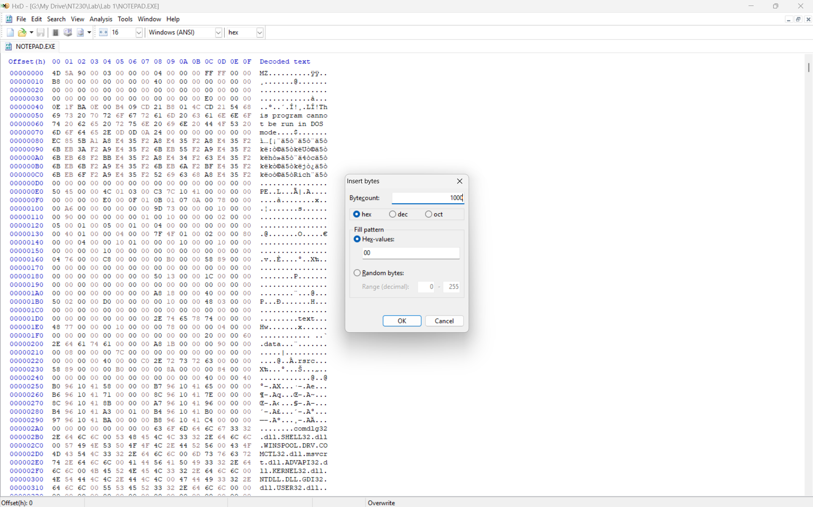
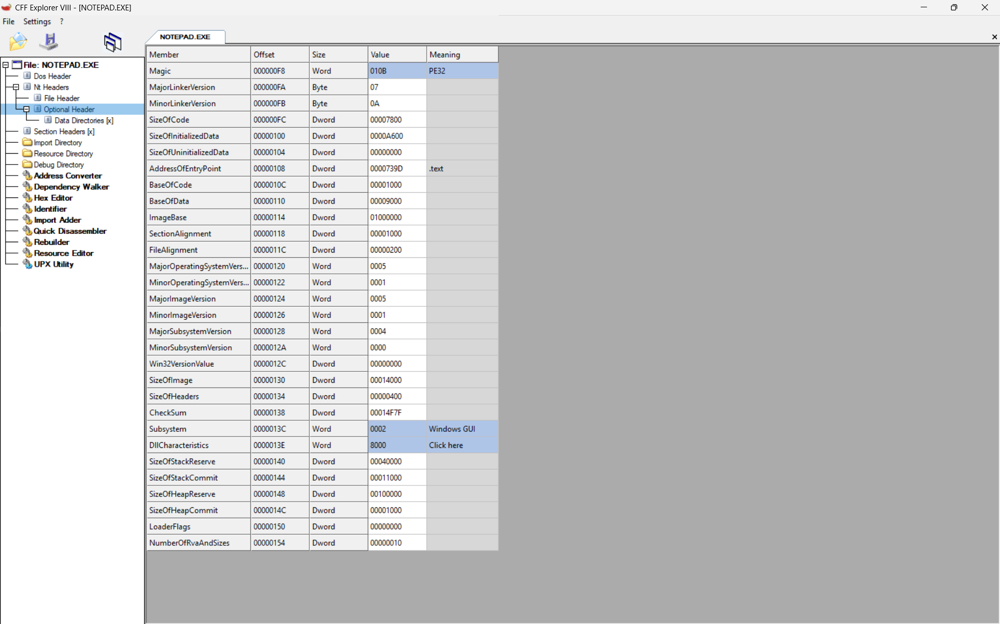
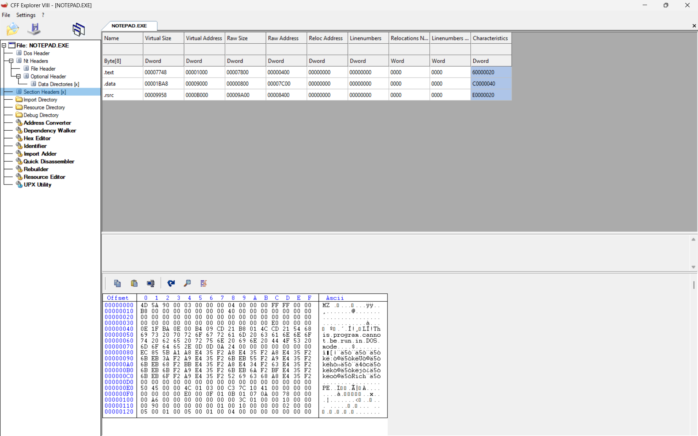
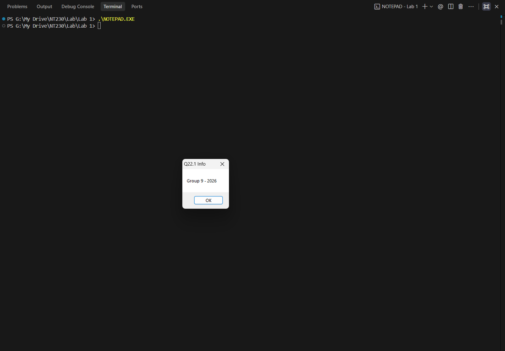

# Source

```c
#include <windows.h>

int main(int argc, char * argv[])
{
    MessageBox(NULL, L"Q22.1 Info", L"Group 09 - 2026", MB_OK);
    return 0;
}
```

# Hợp ngữ

```asm
push 0             ; 6a 00
push Caption       ; 68 X
push Text          ; 68 Y
push 0             ; 6a 00
call [MessageBoxW] ; ff15 Z
```

# Steps by steps

0. Mở rộng .rsrc section thêm 0x1000 bytes thông qua HxD

   

1. Chọn địa chỉ 0x00011000 để chèn code

2. Chọn địa chỉ 0x00010E00 để lưu trữ caption

3. Chọn địa chỉ 0x00010E20 để lưu trữ text

4. Tính X: Offset = RA – Section RA = RVA – Section VA
   => 0x00010E00 (Caption) - 0x00008400 (RA .rsrc) = RVA - 0x0000B000 (VA .rsrc)
   => RVA = 0x00013A00
   => X = ImageBase + RVA = 0x01000000 + 0x00013A00 = 0x01013A00

5. Tính Y: Offset = RA – Section RA = RVA – Section VA
   => 0x00010E20 (Text) - 0x00008400 (RA .rsrc) = RVA - 0x0000B000 (VA .rsrc)
   => RVA = 0x00013A20
   => Y = ImageBase + RVA = 0x01000000 + 0x00013A20 = 0x01013A20

6. Tính Z: MessageBoxW là hàm hệ thống => IDA Pro => Z = 01001268

   

7. Tính EP mới: New-EP = RVA = RA - Section RA + Section VA
   => New-EP = 0x00011000 (Code) - 0x00008400 (RA .rsrc) + 0x0000B000 (VA .rsrc) = 0x00013C00

8. Tính Relative-VA: Old-EP = Jump-Instruction-VA + 5 + Relative-VA
   - Old-EP = 0x0000739D (AddressOfEntryPoint) + 0x01000000 (ImageBase) = 0x0100739D

   

   - Offset Jump = 0x00011000 (Code) + 0x14 (Length of code) = 0x00011014
   - Jump-Instruction-VA = 0x01000000 (ImageBase) + (0x00011014 - 0x00008400 + 0x0000B000) RVA = 0x01013C14
   => Relative-VA = Old-EP - Jump-Instruction-VA - 5 = 0x0100739D - 0x01013C14 - 5 = 0xFFFF3784

9. Hợp ngữ => mã máy:

```asm
push 0             ; 6a 00
push Caption       ; 68 0x01013A00
push Text          ; 68 0x01013A20
push 0             ; 6a 00
call [MessageBoxW] ; ff15 0x01001268
```

```text
6A 00 68 00 3A 01 01 68 20 3A 01 01 6A 00 FF 15
68 12 00 01 E9 84 37 FF FF 00 00 00 00 00 00 00
```

10. Chuyển caption và text sang hex

## Caption
51 00 32 00 32 00 2E 00 31 00 20 00 49 00 6E 00
66 00 6F 00 00 00 00 00 00 00 00 00 00 00 00 00

## Text
47 00 72 00 6F 00 75 00 70 00 20 00 30 00 39 00
20 00 2D 00 20 00 32 00 30 00 32 00 36 00 00 00

11. Chèn mã máy thông qua HxD

   

12. Thay đổi AddressOfEntryPoint = 0x00013C00 thông qua CFF Explorer

   

# Results

