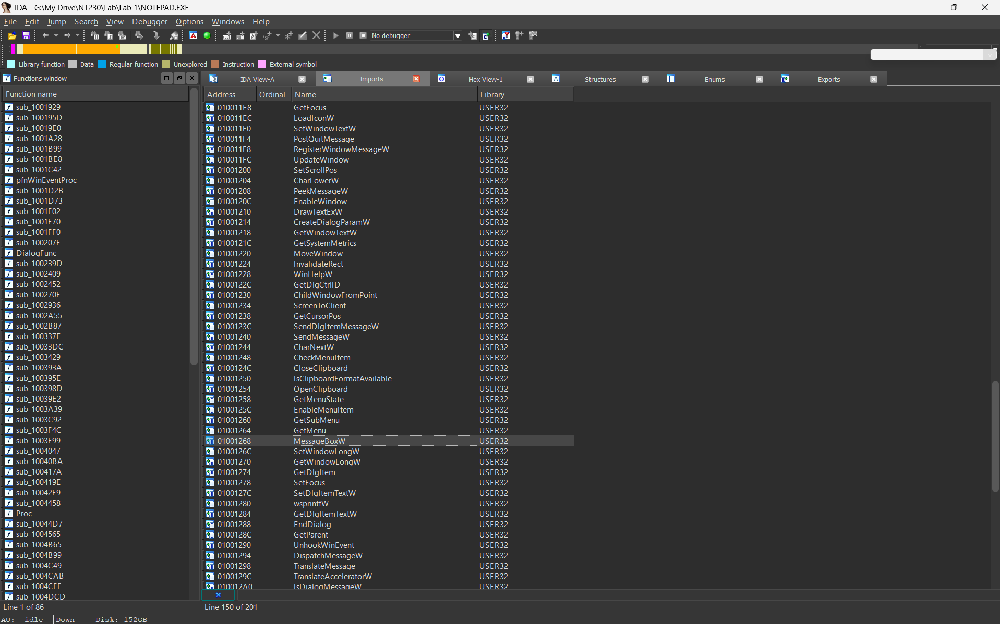
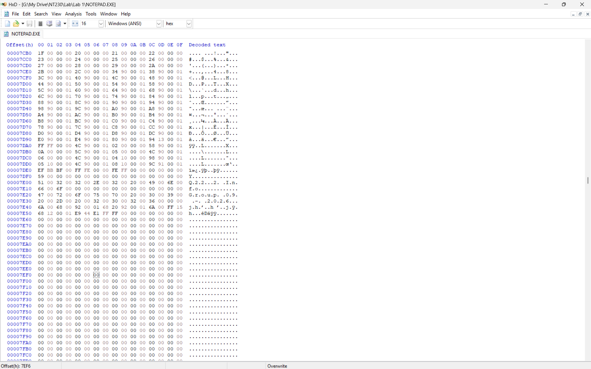
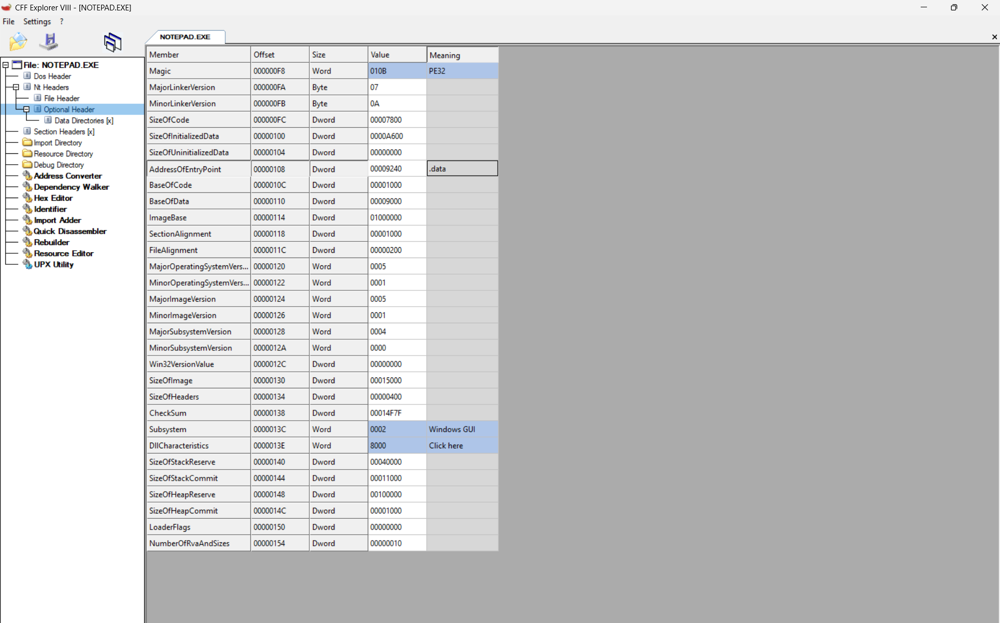
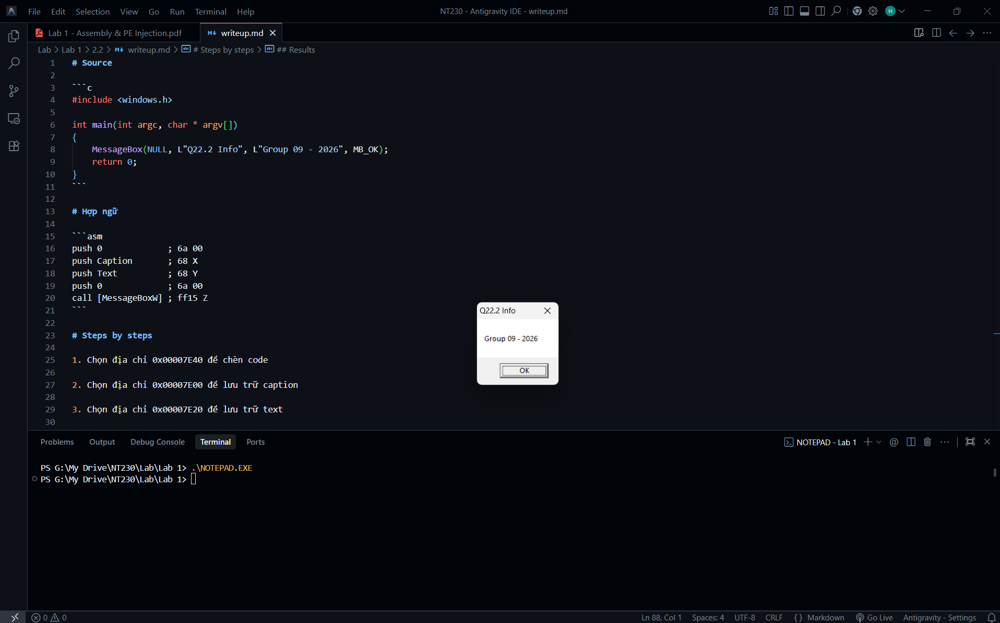

# Source

```c
#include <windows.h>

int main(int argc, char * argv[])
{
    MessageBox(NULL, L"Q22.2 Info", L"Group 09 - 2026", MB_OK);
    return 0;
}
```

# Hợp ngữ

```asm
push 0             ; 6a 00
push Caption       ; 68 X
push Text          ; 68 Y
push 0             ; 6a 00
call [MessageBoxW] ; ff15 Z
```

# Steps by steps

1. Chọn địa chỉ 0x00007E40 để chèn code

2. Chọn địa chỉ 0x00007E00 để lưu trữ caption

3. Chọn địa chỉ 0x00007E20 để lưu trữ text

4. Tính X: Offset = RA – Section RA = RVA – Section VA
   => 0x00007E00 (Caption) - 0x00007C00 (RA .data) = RVA - 0x00009000 (VA .data)
   => RVA = 0x00009200
   => X = ImageBase + RVA = 0x01000000 + 0x00009200 = 0x01009200

5. Tính Y: Offset = RA – Section RA = RVA – Section VA
   => 0x00007E20 (Text) - 0x00007C00 (RA .data) = RVA - 0x00009000 (VA .data)
   => RVA = 0x00009220
   => Y = ImageBase + RVA = 0x01000000 + 0x00009220 = 0x01009220

6. Tính Z: MessageBoxW là hàm hệ thống => IDA Pro => Z = 01001268
   

7. Tính EP mới: New-EP = RVA = RA - Section RA + Section VA 
   => New-EP = 0x00007E40 (Code) - 0x00007C00 (RA .data) + 0x00009000 (VA .data) = 0x00009240

8. Tính Relative-VA: Old-EP = Jump-Instruction-VA + 5 + Relative-VA
   - Old-EP = 0x0000739D (AddressOfEntryPoint) + 0x01000000 (ImageBase) = 0x0100739D
   - Offset Jump = 0x00007E40 (Code) + 0x14 (Length of code) = 0x00007E54
   - Jump-Instruction-VA = 0x01000000 (ImageBase) + (0x00007E54 - 0x00007C00 + 0x00009000) RVA = 0x01009254
   => Relative-VA = Old-EP - Jump-Instruction-VA - 5 = 0x0100739D - 0x01009254 - 5 = 0xFFFFE144

9. Hợp ngữ => mã máy:

```asm
push 0             ; 6a 00
push Caption       ; 68 0x01009200
push Text          ; 68 0x01009220
push 0             ; 6a 00
call [MessageBoxW] ; ff15 0x01001268
```

```text
6A 00 68 00 92 00 01 68 20 92 00 01 6A 00 FF 15
68 12 00 01 00 00 00 00 00 00 00 00 00 00 00 00
```

10. Chuyển caption và text sang hex 

## Caption
51 00 32 00 32 00 2E 00 32 00 20 00 49 00 6E 00 
66 00 6F 00 00 00 00 00 00 00 00 00 00 00 00 00

## Text
47 00 72 00 6F 00 75 00 70 00 20 00 30 00 39 00 
20 00 2D 00 20 00 32 00 30 00 32 00 36 00 00 00

11. Chèn mã máy thông qua HxD



12. Thay đổi AddressOfEntryPoint thông qua CFF Explorer



## Results

