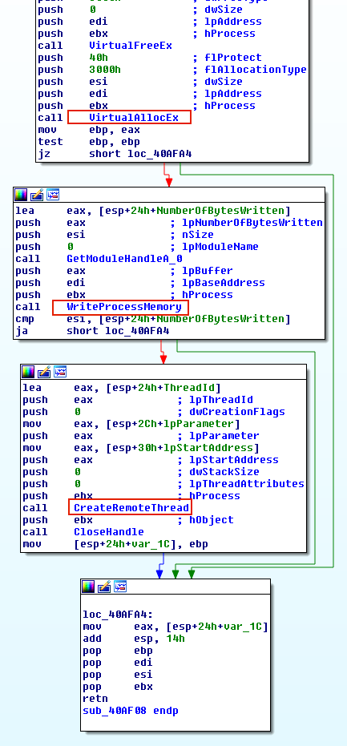
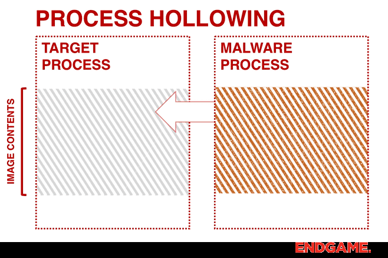
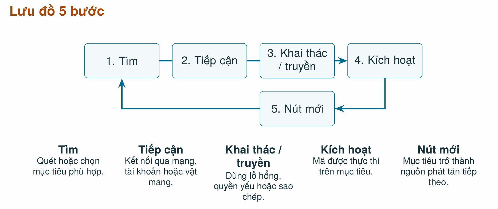
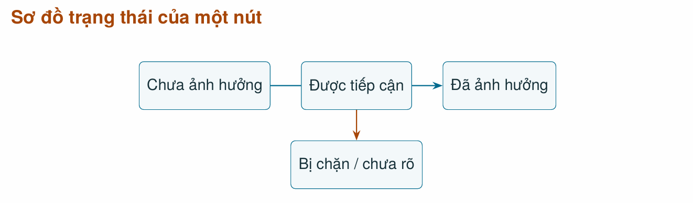
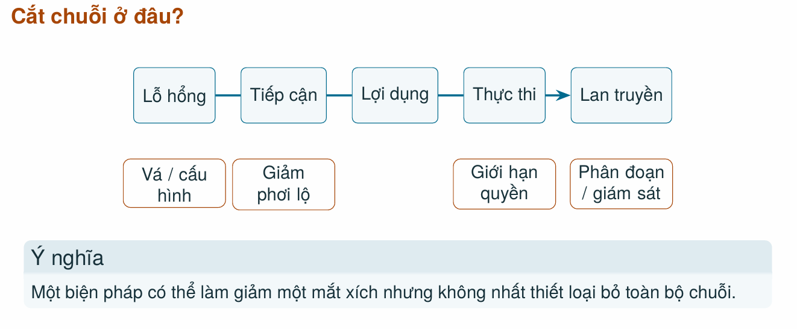

## BUỔI 1: Introduction

### 1.1. Malware

* **Malware:** Phần mềm hoặc mã được thiết kế để thực hiện các hành vi không được phép, gây hại cho hệ thống.

* **Phân loại:**

  * **Virus:** Tự nhân bản bằng cách gắn/chèn vào một host file. Kích hoạt khi host file chạy.
  
  * **Worm:** Tự nhân bản và lây lan qua mạng mà không cần gắn vào host file.
  
  * **Trojan:** Núp bóng ứng dụng hợp lệ nhưng chứa chức năng ẩn độc hại.
  
  * **Ransomware / Wiper:** Ransomware mã hóa dữ liệu đòi tiền chuộc. Wiper ghi đè/phá hủy dữ liệu hoàn toàn.
  
  * **Infostealer / Spyware:** Đánh cắp thông tin xác thực, cookie, theo dõi người dùng.
  
  * **Botnet / RAT:** Bot nhận lệnh điều khiển từ xa. RAT mở cổng truy cập trái phép.
  
  * **Dropper / Downloader / Loader:** Chịu trách nhiệm drop, download, hoặc load **payload** chính vào hệ thống.
  
  * **Rootkit / Bootkit:** Rootkit che giấu sự hiện diện và duy trì **persistence**. Bootkit can thiệp vào chuỗi khởi động.
  
  * **Fileless:** Kỹ thuật lạm dụng công cụ hợp lệ sẵn có để hạn chế để lại dấu vết trên đĩa, nhưng không có nghĩa là hoàn toàn "tàng hình".
  
  * **Logic Bomb:** Đoạn mã chỉ kích hoạt khi thỏa mãn một điều kiện định trước (thời gian, trạng thái).

### 1.2. Cyber kill chains vs MITRE ATT&CK

* **Cyber kill chain:** Mô hình 7 giai đoạn của một cuộc xâm nhập:
  1. Reconnaissance
  2. Weaponization
  3. Delivery
  4. Exploitation
  5. Installation
  6. Command and Control (C2)
  7. Actions on Objectives

* **MITRE ATT&CK:** Cơ sở tri thức mô tả **TTP**:
  
  * **Tactic:** Mục đích chiến thuật.
  
  * **Technique / Sub-technique:** Cách thức đạt được mục đích.
  
  * **Procedure:** Cách triển khai cụ thể được quan sát trong thực tế.
  
*Lưu ý:* Hai framework bổ trợ cho nhau. Cyber Kill Chain mô tả tiến trình tổng thể, còn ATT&CK dùng để gán nhãn hành vi cụ thể (TTPs). Không được ép mọi cuộc tấn công phải tuân theo đúng tuần tự các bước này.

---

## BUỔI 2: Executable File Format

### 2.1. Portable Executable - PE

* **Khái niệm:** Là định dạng mô tả image thực thi của Windows ví dụ: `.exe`, `.dll`, `.sys`, chứa metadata, vùng code/data và thông tin để **loader** nạp image vào memory.

* **Tổng quan:**

| Thành phần | Chức năng / Ý nghĩa phân tích |
| :--- | :--- |
| **DOS Header / Stub** | Bắt đầu bằng chữ ký `MZ`. Chỉ mang tính tương thích lịch sử. Có trường `e_lfanew` trỏ tới NT Headers. |
| **NT Headers** | Gồm **File Header** chứa Machine, NumberOfSections, Characteristics, `TimeDateStamp` và **Optional Header**. *Lưu ý: TimeDateStamp dễ bị giả mạo, không phải bằng chứng tuyệt đối.* |
| **Optional Header** | Chứa thông tin thiết yếu cho loader: `AddressOfEntryPoint`, `ImageBase`, `SectionAlignment`, `FileAlignment`, `Subsystem` và **Data Directory**. |
| **Data Directory** | Bảng con trỏ trỏ tới các cấu trúc dữ liệu quan trọng như: **Import Directory**, **Export**, **Base Relocation**, **TLS Directory**, **Resource**. |
| **Section Table** | Mô tả các section: `.text` (Code), `.rdata` (Read-only data), `.data` (Data có thể ghi), `.rsrc` (Resource), `.reloc` (Relocation). |

* **Lưu ý:** 
  * Section tên lạ, entropy cao hoặc import ít chỉ là "dấu hiệu" để đặt nghi vấn, có thể do packer hợp lệ, không dùng để kết luận ngay là malware. 
  * Không nhầm lẫn **padding** với vùng code/data mới chèn.
  * Không đồng nhất file image với memory image.
  * Không cho rằng `Entry Point` là vị trí duy nhất cần phân tích vì có thể có TLS callback chạy trước.

### 2.2. Ánh xạ địa chỉ

* **Khái niệm:**
  * **File offset:** Vị trí vật lý của dữ liệu nằm trong file trên đĩa.

  * **RVA (Relative Virtual Address):** Địa chỉ tương đối so với `ImageBase` khi image nạp vào memory.
  
  * **VA (Virtual Address):** Địa chỉ ảo tuyệt đối khi nằm trong address space của process.

* **Công thức:**
  $$VA = ImageBase + RVA$$
  
  $$RVA = Section.VirtualAddress + (FileOffset - PointerToRawData)$$

* **Phân biệt kích thước:** `SizeOfRawData` là kích thước trên đĩa, `VirtualSize` là kích thước khi nạp vào memory. Hai giá trị này có thể chênh lệch do quy tắc alignment và dữ liệu chưa khởi tạo.

* **Relocation & ASLR:** Khi image không thể nạp ở `ImageBase` mong muốn, OS sẽ điều chỉnh địa chỉ **Relocation**. Sự khác biệt địa chỉ tĩnh và động thường do cơ chế **ASLR** - Address Space Layout Randomization, không nên nhầm lẫn với dấu hiệu bị can thiệp.

### 2.3. Windows loader

* **Cơ chế:**
  1. `CreateProcess`: Khởi tạo address space.
  2. Đọc headers từ file trên đĩa.
  3. Map các sections vào memory theo cấu hình.
  4. Phân giải **Imports** và thực hiện **Relocation**.
  5. Gọi các **TLS callbacks**.
  6. Bắt đầu thực thi tại **Entry Point**.

* **Các khái niệm vận hành:**

  * **Process:** Không gian địa chỉ và tài nguyên cô lập chứa EXE image, DLL module, Heap, Stack.

  * **Thread:** Luồng thực thi nằm bên trong một process.

  * **Module:** Image chính (`.exe`) hoặc DLL được nạp vào process.

* **Quyền bộ nhớ:** `R` (Read), `W` (Write), `X` (Execute). Một vùng nhớ có quyền `RWX` là tín hiệu bất thường đáng chú ý, cần phân tích sâu.

### 2.4. EXE vs DLL

 EXE có entry point để khởi động process, sở hữu address space riêng; DLL là module chia sẻ address space, có export table để cung cấp API.

### 2.5. PE (Windows) và ELF (Linux)

| Tiêu chí | PE (Windows) | ELF (Linux/Unix) |
| :--- | :--- | :--- |
| **Chữ ký định dạng** | `MZ` (DOS Header), `PE` signature | `ELF` magic |
| **Header chính** | COFF/Optional Header | ELF Header, Program Header |
| **Điểm bắt đầu** | `AddressOfEntryPoint` | `e_entry` |
| **Ánh xạ nạp** | Dựa trên **Section Table** | Dựa trên **Segment** |
| **Liên kết động** | **IAT** (Import Address Table) | Dynamic section, Symbol table |

---

## BUỔI 3: File infection & DLL loading & hollowing

---

### 3.1. Khái niệm

* **Virus file:** Gắn hoặc chèn mã vào tệp để lần chạy sau mã đó được gọi.
* **Injection:** Đưa dữ liệu hoặc mã vào không gian địa chỉ của process khác.
* **DLL loading:** Làm cho process nạp một module DLL, hợp lệ hoặc đáng ngờ.
* **Hollowing:** Tạo process hợp lệ rồi thay nội dung image bằng image khác trước khi chạy.

### 3.2. File infection

* **Nguyên lý:** Mã chèn phải giành quyền điều khiển đủ sớm trước entry point gốc, thực hiện phần việc của nó, sau đó trả quyền điều khiển về luồng gốc để chương trình vẫn hoạt động nhằm tránh bị người dùng nghi ngờ.

* **Kỹ thuật:**

| Kỹ thuật | Mô tả | Rủi ro |
| :--- | :--- | :--- |
| **Overwrite** | Ghi đè trực tiếp lên một vùng mã hoặc dữ liệu hiện có của file chủ. | Đơn giản nhưng dễ làm hỏng chương trình, dễ làm hỏng tính toàn vẹn của PE. |
| **Append** | Thêm mã độc ở cuối file, tạo một đoạn `Stub` trung gian. `Stub` sẽ chuyển hướng entry point từ mã gốc sang mã virus, chạy xong rồi trả về entry point gốc. | Cần phải sửa `AddressOfEntryPoint` trong Optional Header, tăng `raw size` của section cuối. Phải giữ nguyên `alignment` để tránh lỗi loader. |
| **Cavity** | Tận dụng padding bên trong section để chèn mã. | Giảm thiểu việc thay đổi kích thước file. Vùng trống phải nằm trong section đã được ánh xạ vào memory và có quyền phù hợp. Tuyệt đối không được ghi đè lên import data hay relocation. |

* **EPO - Entry-point Obscuring:** Kỹ thuật làm mờ điểm vào. Virus không thay đổi trực tiếp entry point mà hook vào một lệnh hoặc lời gọi hàm sâu bên trong chương trình.

* **Công thức chuyển file thành memory:**

  $$RVA = Section.VirtualAddress + (FileOffset - PointerToRawData)$$

  $$VA = ImageBase + RVA$$

  **Ví dụ:**
  > `VirtualAddress = 0x3000`
  > `PointerToRawData = 0x800`
  > `FileOffset = 0xC00`
  > `ImageBase = 0x140000000`
  >
  > * **RVA** = `0x3000 + (0xC00 - 0x800)` = `0x3400`
  > * **VA** = `0x140000000 + 0x3400` = `0x140003400`

* **Bảng PE metadata cần đối chiếu (File Diff Analysis):**

| Metadata / Quan sát | Dấu hiệu bị can thiệp | Ý nghĩa |
| :--- | :--- | :--- |
| **AddressOfEntryPoint** | Bị đổi trỏ tới vùng section mới | Chuyển hướng luồng thực thi ban đầu |
| **Section Size / Pointer** | `VirtualSize` / `SizeOfRawData` thay đổi | Kích thước file hoặc vùng nhớ nở ra để chứa mã độc |
| **Characteristics** | Có cờ `R`, `W`, `X` dị thường | Cho phép mã tự sửa chính nó hoặc ghi payload mới |

### 3.3. DLL loading

* **DLL loading:** Là chuỗi cơ chế ép một process khác nạp DLL theo ý đồ của attacker.

* **Cơ chế:**
  1. Xác định process đích và gọi `OpenProcess`.

  2. Cấp phát vùng nhớ (`VirtualAllocEx`) bên trong process đích để chứa đường dẫn DLL.

  3. Ghi dữ liệu (`WriteProcessMemory`) chuỗi đường dẫn vào đó.
  
  4. Kích hoạt remote thread (`CreateRemoteThread`) gọi hàm `LoadLibrary` với tham số là địa chỉ vùng nhớ chứa chuỗi.

* **DLL Search Order vs DLL Hijacking:**
  
  * Theo mặc định, Windows Loader nạp DLL theo thứ tự: (1) Danh sách redirection/API sets $\to$ (2) Known DLLs $\to$ (3) **Thư mục ứng dụng** $\to$ (4) System32/Windows dir $\to$ (5) Current Directory $\to$ (6) Các thư mục trong biến `PATH`.

  * **Hijacking:** Attacker bỏ một tệp DLL độc hại trùng tên vào thư mục ứng dụng (vị trí 3). Loader sẽ ưu tiên nạp tệp độc hại này thay vì DLL thật trong System32 (vị trí 4).

* **Import Table vs Export Table:**
  * `Import table` là danh sách phụ thuộc tĩnh. `IAT` - **Import Address Table** lưu địa chỉ thực tế hàm được resolve khi runtime. 

  * `Export table` liệt kê API mà module đó cung cấp. 
  
  * Import chỉ là "khả năng", IAT là "kết quả", dấu vết thực thi mới là "bằng chứng".

### 3.4. Hollowing

* **Định nghĩa:** Tạo một process hợp lệ ở trạng thái `suspended`, unmap image hợp lệ ban đầu, ghi một image độc hại khác vào không gian địa chỉ đó, sửa đổi context/PEB, và tiếp tục `resume` luồng thực thi. Hình thức này làm process tree trông có vẻ bình thường và qua mặt các chốt chặn AV giám sát luồng tiến trình tĩnh.

* **Cơ chế:**
  1. Gọi `CreateProcess` tạo đích ở trạng thái suspended.

  2. Unmap hoặc bỏ qua image ban đầu bằng `NtUnmapViewOfSection`.

  3. Map và ghi image mới vào vùng nhớ rỗng.

  4. Chỉnh sửa thread context và `PEB.ImageBaseAddress` trỏ về image mới bằng `SetThreadContext`.

  5. Gọi `ResumeThread` để thực thi mã độc dưới vỏ bọc hợp lệ.

**Kết luận:** Nếu xảy ra sự lệch pha như PEB mismatch hoặc file-memory mismatch, đó chính là hollowing.

* **Hollowing vs Unpacking:**

| Tiêu chí | Hollowing | Unpacking |
| :--- | :--- | :--- |
| **Process Creation** | Tạo process mới để làm vỏ bọc. | Chạy trực tiếp từ stub của chính image đó. |
| **Nguồn Payload** | Image khác được ghi đè vào không gian ảo. | Payload được giải mã từ bên trong file đang chạy. |
| **Bằng chứng** | `File-memory mismatch` lớn đặc biệt là PEB. | Vùng giải mã, stub, luồng gọi trong cùng một process. |

## BUỔI 4: Worm

### 4.1. Infection vs propagation spread
  
  * **Sự lây nhiễm (Infection):** Là sự kiện một malware xâm nhập, chiếm quyền điều khiển và thực thi thành công trên một máy chủ đơn lẻ. Bản chất của infection tập trung vào phạm vi cục bộ: tiến trình bị tiêm nhiễm, tập tin thực thi bị sửa đổi, hoặc tài nguyên hệ điều hành bị chiếm dụng.

  * **Sự lan truyền (Propagation spread):** Là quá trình mã độc chủ động tự mở rộng địa bàn hoạt động từ nút bị nhiễm sang nhiều nút khác thông qua các kênh liên lạc mạng hoặc phương tiện trung gian, hình thành một chuỗi lây lan có chain reaction trên phạm vi toàn mạng.

---

### 4.2. 5-Stage propagation flow

  * **Target Discovery:** Worm tiến hành trinh sát để xác định danh sách các IP hoặc dịch vụ tiềm năng.

    * **Random Scanning:** Tạo địa chỉ IP ngẫu nhiên 32-bit và gửi gói thăm dò nhưng gây ồn ào, dễ bị phát hiện bởi IDS/NIDS.
    
    * **Subnet / Local-Preference Scanning:** Ưu tiên quét các dải IP lân cận cùng subnet vì các máy trong cùng mạng nội bộ thường dùng chung chính sách bảo mật lỏng lẻo và có độ trễ thấp.
    
    * **Topological / Hit-List Scanning:** Dựa vào thông tin cấu hình có sẵn trên máy nạn nhân hoặc một danh sách mục tiêu được kẻ tấn công chuẩn bị từ trước.
    
    * **Permutation Scanning:** Sử dụng hàm hoán vị giả ngẫu nhiên chia sẻ giữa các nút nhiễm để đảm bảo không quét trùng lặp mục tiêu, tối đa hóa diện tích bao phủ.
    
  * **Carrier:** Lựa chọn cơ chế hoặc vật mang để đưa mã độc tiếp cận máy đích.
    
    * **Phân loại theo cơ chế truyền tải bản thân:**

      * **Self-carried:** Mã được truyền trực tiếp trong quá trình lây nhiễm.

      * **Second channel:** Dùng kênh phụ để tải phần còn lại.
      
      * **Embedded:** Mã gắn trong luồng giao tiếp bình thường.

    * **Phân loại theo cơ chế tiếp cận:**
      
      * **Network payload carrier:** Gửi các gói tin bất thường qua giao thức mạng (SMB, RPC, RDP, HTTP, SSH, Redis).
      
      * **Physical Carrier:** Ghi mã độc vào phân vùng ẩn của USB hoặc tạo shortcut `.LNK` giả mạo tài liệu để chờ người dùng cắm vào máy khác.
      
      * **Credential carrier:** Sử dụng cặp thông tin đăng nhập mặc định hoặc brute force để thiết lập phiên quản trị hợp lệ.
    
  * **Payload transfer & exploit:**
    
    * Tận dụng lỗ hổng tràn bộ đệm (Buffer Overflow), thực thi mã từ xa (RCE), hoặc vượt qua cơ chế cách ly (Sandbox) để giành quyền thực thi.

    * Truyền tải tệp tin độc hại sang máy nạn nhân: có thể thông qua lệnh tải tự động (`curl`, `wget`, `certutil.exe`), chia sẻ tệp SMB (administrative shares `C$`, `ADMIN$`), hoặc đẩy nhị phân trực tiếp trong shellcode.
    
  * **Activation:** Các cơ chế kích hoạt mã độc trên máy đích.

    * **Self activation:** Dịch vụ đang chạy tự xử lý yêu cầu hoặc điều kiện khai thác, thực thi ngay lập tức trong không gian bộ nhớ.
  
    * **Human activation:** Người dùng mở tệp hoặc thực hiện hành động như nhấp mở file `.LNK`, mở tài liệu Word chứa Macro độc, hoặc nhấp vào tệp tin thực thi giả mạo icon thư mục.

    * **Activity-based activation:** Kích hoạt sau khi đăng nhập, khởi động lại hoặc các hoạt động thường ngày của hệ điều hành.
  
  * **Propagation loop:**
    * Nút mới sau khi bị kiểm soát hoàn toàn sẽ khởi tạo module quét độc lập, biến thành một bàn đạp tấn công mới và lặp lại toàn bộ quy trình từ Bước 1 đến Bước 4.

* **Multi-stage payload architecture:**
  * Worm hiện đại hiếm khi chứa toàn bộ mã độc trong một gói tin duy nhất. Thay vào đó, nó chia thành nhiều tầng:

    * **Stage 1 (Stager / Shellcode):** Đoạn mã nhị phân cực nhỏ, tối ưu hóa để vượt qua giới hạn bộ đệm, chịu trách nhiệm vô hiệu hóa phòng thủ cơ bản và thiết lập kênh tải về.

    * **Stage 2 (Dropper / Loader):** Tải về tệp thực thi chính, giải nén, giải mã trong bộ nhớ hoặc ghi tạm vào đĩa, kiểm tra môi trường máy ảo.

    * **Stage 3 (Core engine):** Module chứa logic quét mạng, giải mã kho vũ khí exploit, và quản lý luồng lây lan.

    * **Stage 4 (Final objective):** Mục đích thực sự của kẻ tấn công: triển khai Ransomware tống tiền, cài đặt XMRig đào tiền điện tử, đánh cắp thông tin đăng nhập, hoặc duy trì backdoor C2.

* **4 Trạng thái của nút mạng:**
  Tại một thời điểm $t$, một nút mạng $v$ bất kỳ chỉ có thể thuộc về một trong bốn trạng thái logic:

---

### 4.3. Nguồn lây nhiễm và lỗ hổng

* **Attack vectors:**
  * **1. Physical media - Thiết bị / tệp:**
    
    * *Đặc điểm:* Lây nhiễm qua cổng USB, ổ cứng ngoài. Không phụ thuộc vào kết nối mạng, thường được dùng để vượt qua các vùng mạng cách ly vật lý.
  
  * **2. Network services - Tài khoản / dịch vụ:**
    
    * *Đặc điểm:* Tận dụng các cổng dịch vụ quản trị từ xa mở công khai như SSH - port 22, RDP - port 3389, SMB - port 445, Telnet - port 23, cơ sở dữ liệu Redis - port 6379, MySQL - port 3306.
  
  * **3. Software Vulnerabilities:**
    
    * *Đặc điểm:* Khiếm khuyết trong mã nguồn hoặc kiến trúc thiết kế của ứng dụng/hệ điều hành cho phép kẻ tấn công vượt qua rào cản xác thực hoặc thực thi mã tùy ý.

    * *Phân loại:* 

      * Lỗ hổng 1-day (Đã được nhà sản xuất phát hành bản vá).
      
      * Lỗ hổng 0-day (Chưa được nhà sản xuất phát hành bản vá).

* **Chuỗi điểm kiểm soát cắt đứt lây nhiễm:**
  Để phòng thủ hiệu quả, kiến trúc bảo mật phải thiết lập các chốt chặn tương ứng tại từng điểm tiếp xúc:

* **Ba tầng kết luận trong điều tra sự cố:**
  Khi điều tra viên đối mặt với dấu hiệu bất thường, cần tuân thủ nghiêm ngặt mô hình 3 tầng để tránh quy kết sai lầm:
  
  * **Tầng 1 - Điều kiện:** Các yếu tố môi trường cho phép sự cố xảy ra.
  
  * **Tầng 2 - Sự kiện:** Các dấu vết vật lý được ghi nhận khách quan.
  
  * **Tầng 3 - Tác động:** Hậu quả thực tế xảy ra trên tài sản.
  
  * *Nguyên tắc:* Có "Điều kiện" không đồng nghĩa với việc đã diễn ra "Sự kiện"; và có "Sự kiện" thăm dò chưa chắc đã dẫn tới "Tác động" thực tế.

---